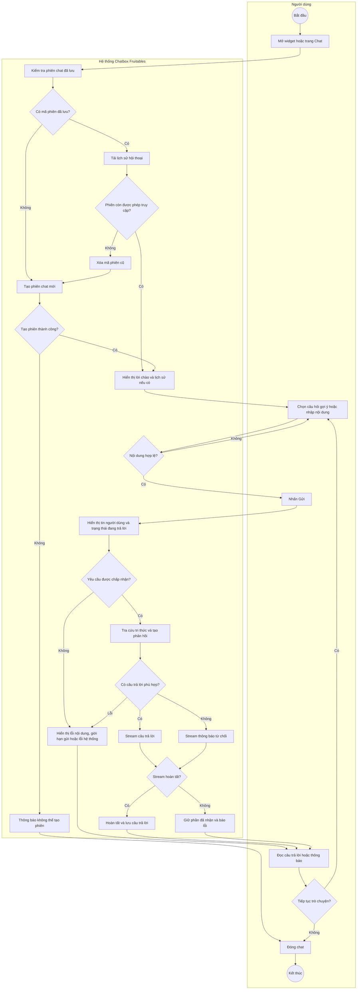

# Chatbox — Flows

## Flow: Người dùng sử dụng chatbox (UML Activity Swimlane)
**Trigger**: Người dùng mở widget hoặc trang Chat hỗ trợ.
**Related UC**: TBD
**Related FR**: TBD
**Related E**: TBD

**Phong cách**: UML activity swimlane PlantUML — **một luồng tổng quát**, chia nhỏ **lane** (không chia phase).

- HTML: [chatbox-user-flow.html](./chatbox-user-flow.html)
- Source: [chatbox-user-flow-swimlane.puml](./chatbox-user-flow-swimlane.puml)
- SVG: [chatbox-user-flow-swimlane.svg](./chatbox-user-flow-swimlane.svg)
- PNG: [chatbox-user-flow-swimlane.png](./chatbox-user-flow-swimlane.png)

**Lane** (tách “Hệ thống Chatbox”, nhãn bước mức nghiệp vụ):

| Lane | Vai trò |
|------|---------|
| Người dùng | Mở chat, hỏi, đọc, đóng |
| Giao diện Chat | Nhớ cuộc chat, hiện tin, gửi tin, cập nhật câu trả lời |
| API Chat | Mở cuộc chat, nhận tin, ghi nhận, điều phối trả lời |
| RAG / AI | Tìm thông tin liên quan, viết câu trả lời, gửi dần |

**Phạm vi**: mở chat → **hiển thị khung** → mở cuộc chat → gửi tin → soạn trả lời → hiện màn hình → hỏi tiếp hoặc đóng.  
**Decision (3)**: mở được không · nhận tin được không · hỏi tiếp không.  
**Regen**: `node .agents/scripts/plantuml-render.mjs docs/chatbox/srs/chatbox-user-flow-swimlane.puml --png`

## Flow: Người dùng sử dụng chatbox (Activity Mermaid)
**Trigger**: Người dùng mở widget hoặc trang Chat hỗ trợ.
**Related UC**: TBD
**Related FR**: TBD
**Related E**: TBD

