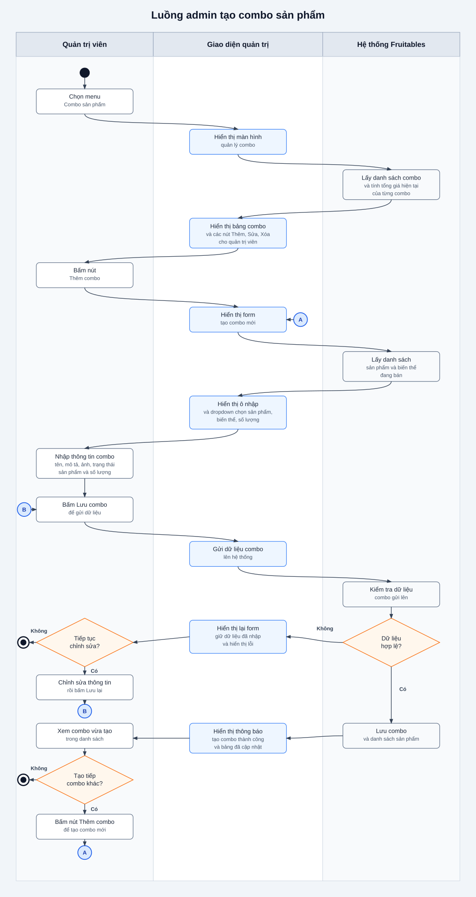

# Combo Flows

## Flow: Luong admin tao combo san pham (Swimlane)
**Trigger**: Quan tri vien bam menu Combo san pham va tao mot combo moi tu giao dien quan tri.
**Related UC**: TBD
**Related FR**: Combo san pham

> Nguon PlantUML: `combo-product-flow-swimlane.puml`. Sua .puml -> chay `node .agents/scripts/plantuml-render.mjs docs/combo/srs/combo-product-flow-swimlane.puml --png` de tao lai .svg va .png.
