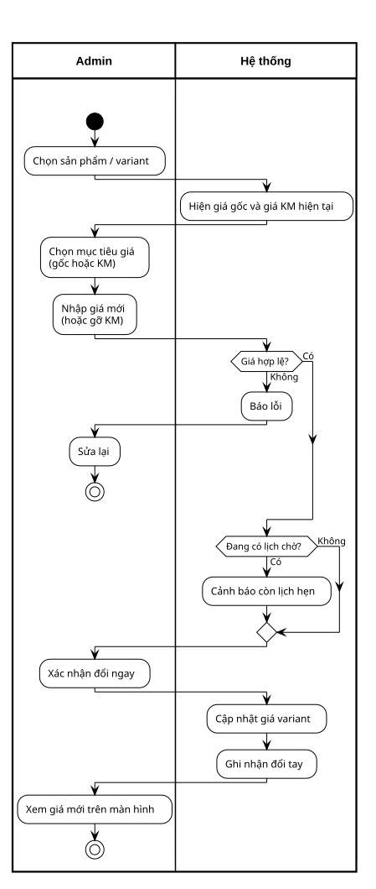
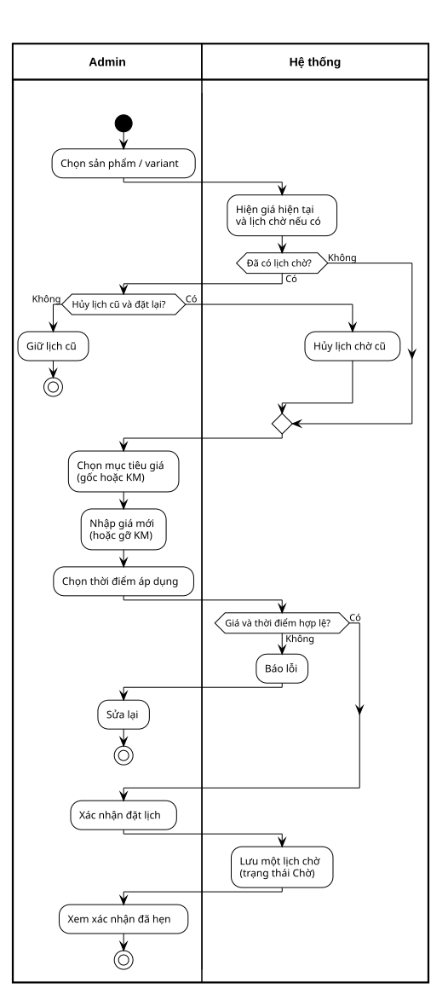
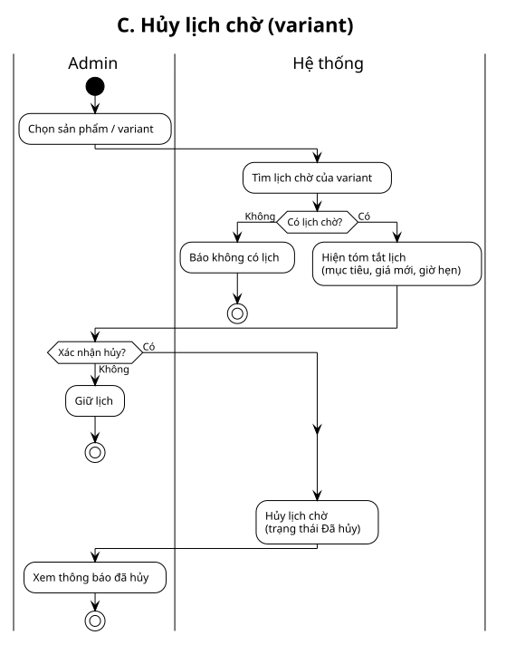
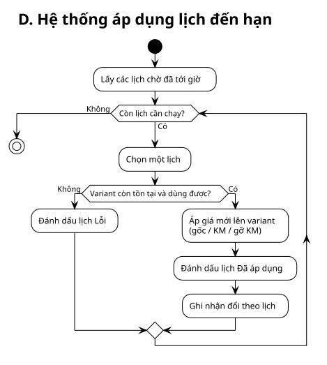

# Price schedule — Flows (Activity swimlane)

**Spec:** [[../../superpowers/specs/2026-07-16-price-schedule-activity-design.md]]

**Lanes:** Admin · Hệ thống  
**Scope:** ProductVariant · 1 lịch chờ / variant · diagram only

| ID | Flow | Source | SVG |
|----|------|--------|-----|
| A | Đổi giá ngay | [puml](./price-a-immediate-swimlane.puml) | [svg](./price-a-immediate-swimlane.svg) |
| B | Đặt lịch hẹn giá | [puml](./price-b-schedule-swimlane.puml) | [svg](./price-b-schedule-swimlane.svg) |
| C | Hủy lịch chờ | [puml](./price-c-cancel-swimlane.puml) | [svg](./price-c-cancel-swimlane.svg) |
| D | Hệ thống áp dụng lịch | [puml](./price-d-apply-swimlane.puml) | [svg](./price-d-apply-swimlane.svg) |

**Quan hệ:**

```
A  Đổi ngay ──────────────────────────► giá hiện tại
B  Đặt lịch ──(Chờ)──► D Áp dụng ─────► giá hiện tại
C  Hủy lịch ──► hết Chờ (D không còn gì cho variant đó)
```

**Regen:**

```bash
node .agents/scripts/plantuml-render.mjs docs/price-schedule/srs/price-a-immediate-swimlane.puml --png
node .agents/scripts/plantuml-render.mjs docs/price-schedule/srs/price-b-schedule-swimlane.puml --png
node .agents/scripts/plantuml-render.mjs docs/price-schedule/srs/price-c-cancel-swimlane.puml --png
node .agents/scripts/plantuml-render.mjs docs/price-schedule/srs/price-d-apply-swimlane.puml --png
```

---

## Flow A: Đổi giá ngay (Swimlane)

**Trigger:** Admin xác nhận đổi giá ngay  
**Related:** Spec §6



> Nguồn: `price-a-immediate-swimlane.puml`

---

## Flow B: Đặt lịch hẹn giá (Swimlane)

**Trigger:** Admin xác nhận đặt lịch  
**Related:** Spec §7  
**Note:** Không ghi giá ngay — chỉ lưu lịch **Chờ**; áp dụng ở D.



> Nguồn: `price-b-schedule-swimlane.puml`

---

## Flow C: Hủy lịch chờ (Swimlane)

**Trigger:** Admin xác nhận hủy lịch  
**Related:** Spec §8  
**Note:** Giá hiện tại không đổi.



> Nguồn: `price-c-cancel-swimlane.puml`

---

## Flow D: Hệ thống áp dụng lịch (Swimlane)

**Trigger:** Tới giờ lịch / job  
**Related:** Spec §9  
**Statuses:** Chờ → Đã áp dụng | Lỗi



> Nguồn: `price-d-apply-swimlane.puml`
