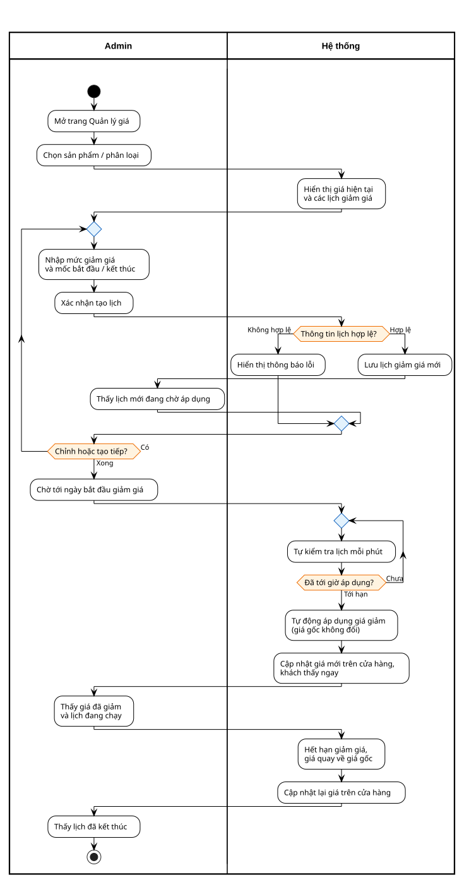

# Price schedule — Flows (Activity swimlane)

**Lanes:** Admin · Hệ thống  
**Scope:** ProductVariant · 1 lịch chờ / variant · diagram only  
**Quy ước vẽ:** lỗi / không xác nhận → **quay lại** chỉnh tiếp; chỉ **stop** khi Admin thoát màn hình hoặc lịch kết thúc.  
**Artifact:** chỉ giữ **`.puml` + `.svg`** (không dùng PNG).

| ID | Flow | Source | SVG |
|----|------|--------|-----|
| E | Tạo và tự động áp dụng lịch giảm giá | [puml](./price-e-create-apply-swimlane.puml) | [svg](./price-e-create-apply-swimlane.svg) |

**Regen (chỉ SVG) + đóng khung StarUML:**

```bash
node .agents/scripts/plantuml-render.mjs docs/price-schedule/srs/price-e-create-apply-swimlane.puml
node docs/chatbox/srs/frame-svg.mjs docs/price-schedule/srs/price-e-create-apply-swimlane.svg --lanes "Admin,Hệ thống"
```

---

## Flow E: Tạo và tự động áp dụng lịch giảm giá (Swimlane)

**Trigger:** Admin xác nhận tạo lịch; job hệ thống quét lịch mỗi phút, tự áp dụng khi tới hạn  
**Lanes:** Admin · Hệ thống (job tự chạy nằm trong lane Hệ thống)  
**Statuses:** Chờ → Đang chạy → Đã kết thúc  
**Note:** Không ghi đè giá gốc — giá hiệu lực tính từ lịch đang chạy; hết hạn giá tự quay về giá gốc.



> Nguồn: `price-e-create-apply-swimlane.puml`. Sửa .puml → chạy lại 2 lệnh regen ở trên.

## Price integrity rules

- Giá gốc được lưu tại `Products.Price` hoặc `ProductVariants.Price`; giá hiệu lực không được ghi đè vào hai cột này.
- Lịch giá dùng khoảng thời gian nửa mở: bắt đầu được tính, thời điểm kết thúc không còn được tính.
- Một đối tượng chỉ có một lịch đang hiệu lực. Nếu dữ liệu cũ vi phạm, hệ thống chọn lịch có `StartsAt` mới nhất, sau đó chọn `Id` lớn nhất.
- Giá cố định phải lớn hơn 0 và nhỏ hơn giá gốc. Giảm phần trăm phải từ 1% đến 99%.
- Hủy trước khi lịch bắt đầu có trạng thái `Cancelled`; dừng sau khi đã bắt đầu có trạng thái `StoppedEarly`.
- Mỗi lần sửa giá/lịch phải gửi revision đã xem. Revision không khớp thì hệ thống từ chối và yêu cầu tải lại.
- Bulk update là nguyên tử: một dòng sai hoặc stale thì không dòng nào được cập nhật.
- Checkout định giá lại trong cùng transaction `Serializable` với tạo đơn và trừ kho.
- `OrderItems.BasePrice`, `OrderItems.Price`, `OrderItems.PromotionDiscount`, và `OrderItems.PriceScheduleId` là snapshot bất biến tại thời điểm đặt hàng.
- Khi tắt biến thể hoạt động cuối cùng, hệ thống chỉ cho phép nếu không còn lịch biến thể đang chạy/sắp tới; sau đó sao chép giá và tồn kho của biến thể sang sản phẩm gốc.
