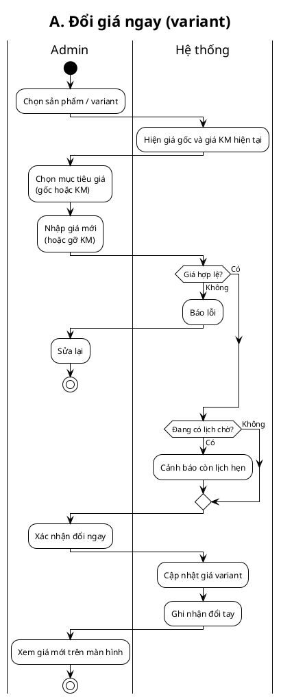
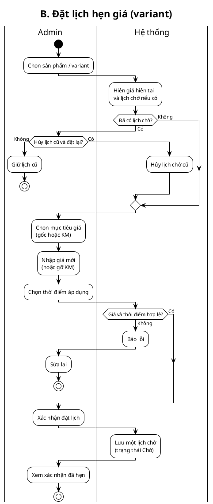
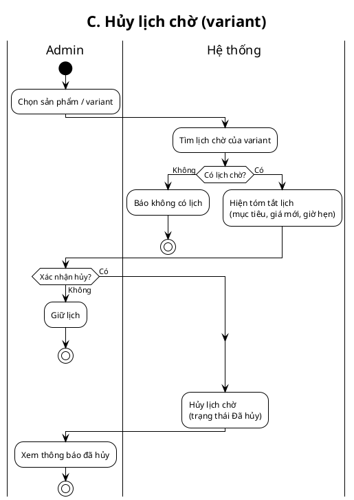
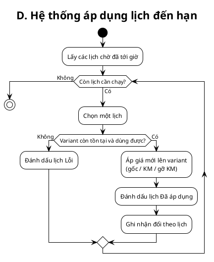

# Price schedule — Activity diagrams plan

> **For agentic workers:** REQUIRED SUB-SKILL: Use superpowers:subagent-driven-development (recommended) or superpowers:executing-plans to implement this plan task-by-task. Steps use checkbox (`- [ ]`) syntax for tracking.

**Goal:** Produce four UML activity swimlane diagrams (Admin | Hệ thống) for variant price management, from the approved design spec — documentation artifacts only, no application code.

**Architecture:** One PlantUML activity swimlane per flow (A immediate, B schedule, C cancel, D apply). Shared style with existing chatbox diagrams: `!theme plain`, `StartColor`/`EndColor` black (● / ◎), business-level Vietnamese labels, no HTTP jargon. Optional post-process frame via `docs/chatbox/srs/frame-svg.mjs` pattern if closed StarUML-style header is required.

**Tech Stack:** PlantUML (render via `node .agents/scripts/plantuml-render.mjs`), Markdown index, optional SVG frame script.

**Spec:** `docs/superpowers/specs/2026-07-16-price-schedule-activity-design.md`

## Global Constraints

- Scope: **activity diagrams only** — no C# / DB / admin UI implementation.
- Lanes: **Admin** | **Hệ thống** only (no manager approval).
- Price target: **Price** or **SalePrice** per action (one target).
- Scope entity: **ProductVariant**.
- At most **one pending schedule** per variant.
- Schedule may **raise, lower, set promo, or clear promo**.
- Admin ops: immediate change + schedule + cancel; System applies due schedules.
- Labels: business Vietnamese, general (not GET/POST/SSE).
- Every branch ends in `stop`/`end` or clear loop-back; re-declare `|Lane|` inside each if/else branch.
- PlantUML: avoid quoting activity labels with `"`; no `goto`.

---

## File map

| Path | Role |
|------|------|
| `docs/price-schedule/srs/price-a-immediate-swimlane.puml` | Flow A source |
| `docs/price-schedule/srs/price-a-immediate-swimlane.svg` (+ `.png`) | Flow A render |
| `docs/price-schedule/srs/price-b-schedule-swimlane.puml` | Flow B source |
| `docs/price-schedule/srs/price-b-schedule-swimlane.svg` (+ `.png`) | Flow B render |
| `docs/price-schedule/srs/price-c-cancel-swimlane.puml` | Flow C source |
| `docs/price-schedule/srs/price-c-cancel-swimlane.svg` (+ `.png`) | Flow C render |
| `docs/price-schedule/srs/price-d-apply-swimlane.puml` | Flow D source |
| `docs/price-schedule/srs/price-d-apply-swimlane.svg` (+ `.png`) | Flow D render |
| `docs/price-schedule/srs/price-schedule-flows.md` | Index: triggers, links, related FR TBD |
| `docs/price-schedule/srs/price-schedule-index.html` (optional) | Gallery linking 4 SVGs |

---

### Task 1: Scaffold docs folder + flows index

**Files:**
- Create: `docs/price-schedule/srs/price-schedule-flows.md`

**Interfaces:**
- Consumes: design spec sections 4–11
- Produces: index markdown other tasks append to

- [ ] **Step 1: Create directory and index skeleton**

Create `docs/price-schedule/srs/price-schedule-flows.md` with:

```markdown
---
type: srs-flows
feature: price-schedule
updated: 2026-07-16
---

# Price schedule — Flows (Activity swimlane)

**Spec:** [[../../superpowers/specs/2026-07-16-price-schedule-activity-design.md]]

**Lanes:** Admin · Hệ thống  
**Scope:** ProductVariant · 1 lịch chờ / variant · diagram only

| ID | Flow | Source | SVG |
|----|------|--------|-----|
| A | Đổi giá ngay | TBD | TBD |
| B | Đặt lịch hẹn giá | TBD | TBD |
| C | Hủy lịch chờ | TBD | TBD |
| D | Hệ thống áp dụng lịch | TBD | TBD |
```

- [ ] **Step 2: Commit**

```bash
git add docs/price-schedule/srs/price-schedule-flows.md
git commit -m "docs(price-schedule): scaffold flows index for activity diagrams"
```

---

### Task 2: Diagram A — Đổi giá ngay

**Files:**
- Create: `docs/price-schedule/srs/price-a-immediate-swimlane.puml`
- Create: `docs/price-schedule/srs/price-a-immediate-swimlane.svg` (via render)
- Create: `docs/price-schedule/srs/price-a-immediate-swimlane.png` (via render `--png`)
- Modify: `docs/price-schedule/srs/price-schedule-flows.md` (row A + section)

**Interfaces:**
- Consumes: Spec §6 Flow A
- Produces: A swimlane artifacts

- [ ] **Step 1: Write PlantUML source**

`price-a-immediate-swimlane.puml` must include (Vietnamese labels, 2 lanes):



Adjust only if compile fails; keep same steps as spec §6.

- [ ] **Step 2: Render**

```bash
node .agents/scripts/plantuml-render.mjs docs/price-schedule/srs/price-a-immediate-swimlane.puml --png
```

Expected: exit 0, SVG + PNG created; no "Syntax Error" in SVG.

- [ ] **Step 3: Visual check**

Open PNG: initial ● on Admin; final ◎; decision diamonds labeled; no wrong-lane nodes (re-declare `|Lane|` in branches if mis-placed).

- [ ] **Step 4: Update flows.md**

Replace A row TBD with paths to `.puml` / `.svg`. Add section:

```markdown
## Flow A: Đổi giá ngay (Swimlane)
**Trigger:** Admin xác nhận đổi giá ngay  
**Related:** Spec §6


```

- [ ] **Step 5: Commit**

```bash
git add docs/price-schedule/srs/price-a-immediate-swimlane.* docs/price-schedule/srs/price-schedule-flows.md
git commit -m "docs(price-schedule): add activity A immediate price change"
```

---

### Task 3: Diagram B — Đặt lịch hẹn giá

**Files:**
- Create: `docs/price-schedule/srs/price-b-schedule-swimlane.puml`
- Create: `docs/price-schedule/srs/price-b-schedule-swimlane.svg` (+ `.png`)
- Modify: `docs/price-schedule/srs/price-schedule-flows.md`

**Interfaces:**
- Consumes: Spec §7 Flow B
- Produces: B swimlane artifacts

- [ ] **Step 1: Write PlantUML**

Key branches (must appear):

1. Show current prices + pending if any  
2. Decision **Đã có lịch chờ?** → Có: Admin **Hủy & đặt lại** vs **Giữ / thoát** (Giữ → stop)  
3. Choose target (gốc/KM), new price, future datetime  
4. Decision **Hợp lệ?** (price + time > now)  
5. Confirm → System saves **one** Pending schedule  
6. Admin sees confirmation → stop  

Do **not** apply price on B (only on D).

Skeleton:



- [ ] **Step 2: Render**

```bash
node .agents/scripts/plantuml-render.mjs docs/price-schedule/srs/price-b-schedule-swimlane.puml --png
```

Expected: exit 0.

- [ ] **Step 3: Visual check**

Replace/keep branches both end correctly; no price-write activity on System after confirm except “Lưu lịch chờ”.

- [ ] **Step 4: Update flows.md** (table row B + section with ``)

- [ ] **Step 5: Commit**

```bash
git add docs/price-schedule/srs/price-b-schedule-swimlane.* docs/price-schedule/srs/price-schedule-flows.md
git commit -m "docs(price-schedule): add activity B schedule price change"
```

---

### Task 4: Diagram C — Hủy lịch chờ

**Files:**
- Create: `docs/price-schedule/srs/price-c-cancel-swimlane.puml`
- Create: `docs/price-schedule/srs/price-c-cancel-swimlane.svg` (+ `.png`)
- Modify: `docs/price-schedule/srs/price-schedule-flows.md`

**Interfaces:**
- Consumes: Spec §8 Flow C
- Produces: C swimlane artifacts

- [ ] **Step 1: Write PlantUML**

Must include:

- No pending → message → stop  
- Show summary (target, price, time)  
- Confirm no → stop (keep schedule)  
- Confirm yes → System marks Cancelled → stop  
- **No** current price change on success  



- [ ] **Step 2: Render**

```bash
node .agents/scripts/plantuml-render.mjs docs/price-schedule/srs/price-c-cancel-swimlane.puml --png
```

- [ ] **Step 3: Visual check + update flows.md + commit**

```bash
git add docs/price-schedule/srs/price-c-cancel-swimlane.* docs/price-schedule/srs/price-schedule-flows.md
git commit -m "docs(price-schedule): add activity C cancel pending schedule"
```

---

### Task 5: Diagram D — Hệ thống áp dụng lịch

**Files:**
- Create: `docs/price-schedule/srs/price-d-apply-swimlane.puml`
- Create: `docs/price-schedule/srs/price-d-apply-swimlane.svg` (+ `.png`)
- Modify: `docs/price-schedule/srs/price-schedule-flows.md`

**Interfaces:**
- Consumes: Spec §9 Flow D
- Produces: D swimlane artifacts

- [ ] **Step 1: Write PlantUML**

Mostly **Hệ thống** lane; optional empty Admin or note “Admin xem sau”.

Must include:

- Load pending with apply-at ≤ now  
- Loop: any left? no → stop  
- Variant OK? no → Failed → next  
- Apply price → Applied → next  



If `while` fails compile on plantuml.com, rewrite as `repeat`/`if` loop with same semantics.

- [ ] **Step 2: Render**

```bash
node .agents/scripts/plantuml-render.mjs docs/price-schedule/srs/price-d-apply-swimlane.puml --png
```

- [ ] **Step 3: Visual check + update flows.md + commit**

```bash
git add docs/price-schedule/srs/price-d-apply-swimlane.* docs/price-schedule/srs/price-schedule-flows.md
git commit -m "docs(price-schedule): add activity D apply due schedule"
```

---

### Task 6: Coverage check + optional gallery

**Files:**
- Modify: `docs/price-schedule/srs/price-schedule-flows.md`
- Create (optional): `docs/price-schedule/srs/price-schedule-index.html`

**Interfaces:**
- Consumes: A–D artifacts + Spec §11–13
- Produces: complete index; optional HTML gallery

- [ ] **Step 1: Spec coverage checklist** (manually tick in PR or commit message)

From design spec, verify each appears on a diagram:

| Spec item | Diagram |
|-----------|---------|
| Immediate change | A |
| Warn if pending on immediate | A |
| Schedule create | B |
| Replace vs keep pending | B |
| No price write on B | B |
| Cancel pending | C |
| No price change on C | C |
| Apply due / Failed / Applied | D |
| One pending / any price direction | B + notes in flows.md |

- [ ] **Step 2: Finalize flows.md**

Ensure table has all four real paths; add short “Quan hệ A–D” mermaid or bullet list from Spec §12.

- [ ] **Step 3 (optional): HTML gallery**

Minimal page listing four `` with titles A–D (same pattern as `docs/chatbox/srs/chatbox-user-flow.html` embed style). Skip StarUML frame post-process unless user requests.

- [ ] **Step 4: Commit**

```bash
git add docs/price-schedule/srs/
git commit -m "docs(price-schedule): complete activity flow index and coverage"
```

---

## Self-review (plan vs spec)

| Spec section | Task |
|--------------|------|
| §4 four diagrams | Tasks 2–5 |
| §5 shared rules | Global constraints + A/B decisions |
| §6 A | Task 2 |
| §7 B | Task 3 |
| §8 C | Task 4 |
| §9 D | Task 5 |
| §10 statuses | Labels on B/C/D |
| §11 errors | Decisions in A–D |
| §13 success criteria | Task 6 checklist |

No implementation/code tasks (YAGNI for diagram-only scope).

---

## Execution handoff

Plan complete and saved to `docs/superpowers/plans/2026-07-16-price-schedule-activity-diagrams.md`.

**Two execution options:**

1. **Subagent-Driven (recommended)** — fresh subagent per task, review between tasks  
2. **Inline Execution** — run tasks in this session with checkpoints  

Which approach?
